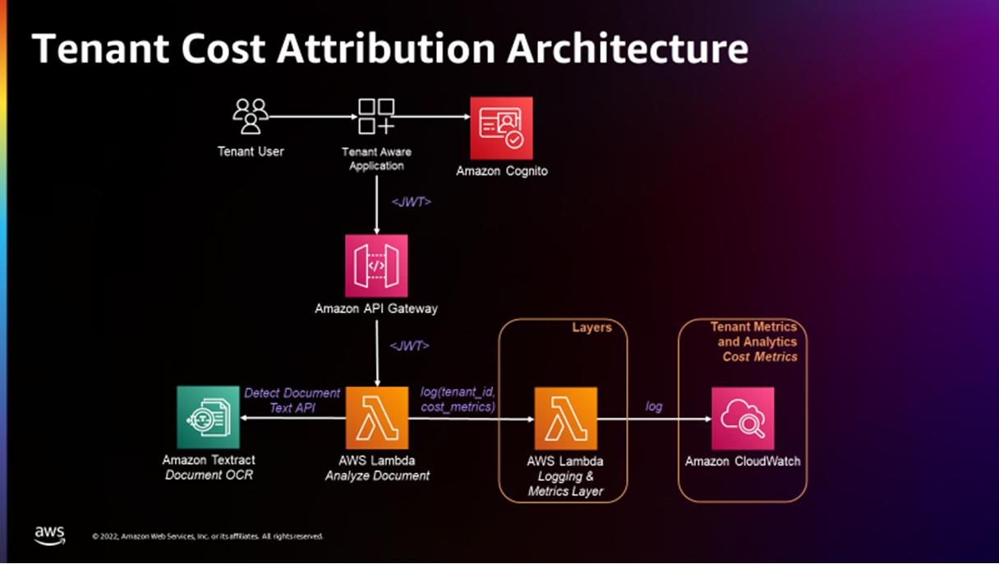

# Unicornhealth

This project was generated with [Angular CLI](https://github.com/angular/angular-cli) version 14.2.2.

## Instructions

### 1) Set Environment Variables
 - These MUST be set (either locally or on hosting resource)
    - PROJECTREGION=""
    - CONGNITOIDENTITYPOOLID=""
    - COGNITOUSERPOOLID=""
    - COGNITOAPPCLIENTID=""
    - S3BUCKETURL=""
    - APISERVICEURL=""
    - TENANTID=""

Windows: Run `setenvironment.cmd` from the frontend\unicornhealth\
Linux/Cloud9: Run `. setenvironment.sh` from the frontend\unicornhealth\

### 2) Build
Run `npm install` to add node locally to the frontend project and to pull in dependencies.

Run `ng build` to build the project. The build artifacts will be stored in the `dist/` directory.

### 3) Development server

Run `ng serve --port 8080` for a dev server. Navigate to `http://localhost:8080/`. The application will automatically reload if you change any of the source files.

## Angular

### Code scaffolding

Run `ng generate component component-name` to generate a new component. You can also use `ng generate directive|pipe|service|class|guard|interface|enum|module`.

### Running unit tests

Run `ng test` to execute the unit tests via [Karma](https://karma-runner.github.io).

### Running end-to-end tests

Run `ng e2e` to execute the end-to-end tests via a platform of your choice. To use this command, you need to first add a package that implements end-to-end testing capabilities.

### Further help

To get more help on the Angular CLI use `ng help` or go check out the [Angular CLI Overview and Command Reference](https://angular.io/cli) page.

## Relevant AWS and Angular References: 
- [Amplify UI Angular](https://ui.docs.amplify.aws/angular/connected-components/authenticator/customization)
- [Amplify UI Custom Sign Up Fields](https://ui.docs.amplify.aws/angular/connected-components/authenticator/customization#sign-up-fields)
- [Amplify Angular Docs](https://docs.amplify.aws/start/getting-started/auth/q/integration/angular/)
- [Amplify - re-use existing authentication resource](https://docs.amplify.aws/lib/auth/start/q/platform/js/#re-use-existing-authentication-resource)
- [Amplify JavaScript Libraries - Authentication](https://docs.amplify.aws/lib/auth/getting-started/q/platform/js/)
- [Amplify Sign up, Sign in, & Sign out API calls](https://docs.amplify.aws/lib/auth/emailpassword/q/platform/js/#auto-sign-in-after-sign-up)
- [System environment variables in Angular](https://medium.com/@fidelisclayton/system-environment-variables-in-angular-1f4a922c7b4c)
- [Angular prevent unauthorized access](https://angular.io/guide/router#preventing-unauthorized-access)
- [Angular Route guards](https://angular.io/guide/router-tutorial-toh#milestone-5-route-guards)
- [Amplify not configured correctly error](https://github.com/aws-amplify/amplify-js/discussions/5836)
- [Amplify Authentication Retrieve current session](https://docs.amplify.aws/lib/auth/manageusers/q/platform/js/#retrieve-current-session)
- [Amplify Angular leads to 403 when page refresh #3606](https://github.com/aws-amplify/amplify-cli/issues/3606)
- [Amplify Hosting  - Redirects for SPA](https://docs.aws.amazon.com/amplify/latest/userguide/redirects.html#redirects-for-single-page-web-apps-spa)